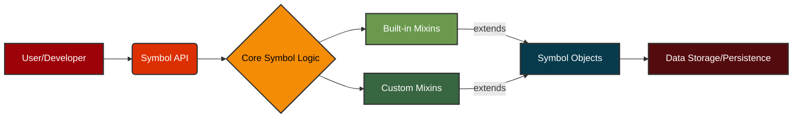

# `«symbol»` Affect

## Catalyzing Value and Unifying Knowledge

### Empowering Innovation Through Semantic Precision and Seamless Integration

In today's rapidly evolving technological landscape, the ability to precisely define, manage, and integrate complex concepts is paramount for driving innovation and maintaining a competitive edge. The Symbol framework addresses this critical need by providing a principled approach to representing and manipulating knowledge within software systems. By offering a robust foundation for semantic modeling, Symbol empowers organizations to:

*   **Accelerate Value Creation:** Streamline the development of sophisticated applications by providing a clear, unambiguous way to define and relate domain-specific concepts. This reduces development cycles, minimizes errors, and allows teams to focus on delivering core business logic rather than wrestling with data inconsistencies.
*   **Ensure Seamless Integration:** Facilitate effortless interoperability between disparate systems and data sources. Symbol's emphasis on canonical representation and well-defined relationships ensures that information can flow freely and accurately across organizational boundaries, breaking down data silos and fostering a unified view of critical assets.
*   **Generalize and Unify Knowledge:** Transcend the limitations of rigid, application-specific data models. By enabling the creation of a flexible, extensible knowledge graph, Symbol allows for the generalization of concepts and their relationships, fostering a holistic understanding of complex domains. This unified knowledge base becomes a strategic asset, enabling advanced analytics, intelligent automation, and the development of novel solutions that leverage interconnected insights.

### Example: Compact Graph Representation

The Symbol framework excels at representing intricate relationships in a concise and human-readable format. Consider the following example, demonstrating a compact graph of interconnected concepts:


<details>
<summary>this is the result of Python code</summary>

```python
from symbol import Symbol, s

# Define the symbols
Financial_Instrument = s.Financial_Instrument
Stock = s.Stock
Bond = s.Bond
Exchange = s.Exchange
Corporation = s.Corporation
Country = s.Country

# Establish relationships
Financial_Instrument.relate(Stock, how="has type")
Financial_Instrument.relate(Bond, how="has type")
Stock.relate(Exchange, how="traded on")
Bond.relate(Corporation, how="issued by")
Exchange.relate(Country, how="located in")
Corporation.relate(Country, how="located in")

# Set node shapes, `round` is default
Financial_Instrument.node_shape = "subroutine"
Exchange.node_shape = "rhombus"
Corporation.node_shape = "subroutine"

# Generate the Mermaid diagram source
mermaid_source = Financial_Instrument.to_mmd()

# Print the Mermaid diagram source
print(mermaid_source)
```

</details>


<details>
<summary>that leads to diagram representation</summary>

```css
graph LR
Bond(Bond)
Corporation[Corporation]
Country(Country)
Exchange{Exchange}
Financial_Instrument[Financial_Instrument]
Stock(Stock)
    Financial_Instrument -- has type --> Stock
    Stock -- traded on --> Exchange
    Exchange -- located in --> Country
    Financial_Instrument -- has type --> Bond
    Bond -- issued by --> Corporation
    Corporation -- located in --> Country 
```

</details>


<details>
<summary>with colors added</summary>

```css
    %% Financial instruments - warm reds
    style Financial_Instrument fill:#e63946,stroke:#333,stroke-width:2px,color:#FFFFFF;
    style Stock fill:#e76f51,stroke:#333,stroke-width:2px,color:#FFFFFF;
    style Bond fill:#f4a261,stroke:#333,stroke-width:2px,color:#000000;
    
    %% Market entities - blues
    style Exchange fill:#1d3557,stroke:#333,stroke-width:2px,color:#FFFFFF;
    style Corporation fill:#457b9d,stroke:#333,stroke-width:2px,color:#FFFFFF;
    
    %% Location - green
    style Country fill:#2a9d8f,stroke:#333,stroke-width:2px,color:#FFFFFF;
```

</details>


### Business Impact of a Symbol Domain-Specific Language (DSL)

The adoption of a Symbol-based Domain-Specific Language (DSL) can yield significant business advantages:

*   **Increased Agility:** Rapidly adapt to changing business requirements by modifying the DSL rather than rewriting extensive application code. This accelerates time-to-market for new features and products.
*   **Reduced Development Costs:** Empower domain experts to directly contribute to system logic through the intuitive DSL, minimizing the need for constant developer intervention. This frees up engineering resources for more complex architectural challenges.
*   **Improved Communication and Collaboration:** Foster a shared understanding between business stakeholders and technical teams. The DSL acts as a common language, reducing misinterpretations and ensuring that implemented solutions accurately reflect business intent.
*   **Enhanced Maintainability and Scalability:** Create self-documenting systems where the business logic is explicitly captured in the DSL. This simplifies maintenance, reduces technical debt, and allows for easier scaling of operations.
*   **Greater Data Consistency and Quality:** Enforce semantic rules and constraints directly within the DSL, leading to higher data quality and reduced errors across integrated systems.

### Developer Friendly Interface



<details>
<summary>this is the result of Python code</summary>

```python
from symbol import s

# Define the architectural components as Symbols
User_Developer = s.User_Developer
Symbol_API = s.Symbol_API
Core_Symbol_Logic = s.Core_Symbol_Logic
Built_in_Mixins = s.Built_in_Mixins
Custom_Mixins = s.Custom_Mixins
Symbol_Objects = s.Symbol_Objects
Data_Storage_Persistence = s.Data_Storage_Persistence

# Establish relationships
User_Developer.relate(Symbol_API, how="interacts with")
Symbol_API.relate(Core_Symbol_Logic, how="uses")
Core_Symbol_Logic.relate(Built_in_Mixins, how="integrates")
Core_Symbol_Logic.relate(Custom_Mixins, how="integrates")
Built_in_Mixins.relate(Symbol_Objects, how="extends")
Custom_Mixins.relate(Symbol_Objects, how="extends")
Symbol_Objects.relate(Data_Storage_Persistence, how="persists to")

# Set node shapes
User_Developer.node_shape = "square"
Core_Symbol_Logic.node_shape = "rhombus"
Built_in_Mixins.node_shape = "square"
Custom_Mixins.node_shape = "square"
Symbol_Objects.node_shape = "square"

# Generate the Mermaid diagram source
mermaid_source = User_Developer.to_mmd()

# Print the Mermaid diagram source
print(mermaid_source)
```

</details>


<details>
<summary>that leads to diagram representation</summary>

```css
graph LR
    A[User/Developer] --> B(Symbol API)
    B --> C{Core Symbol Logic}
    C --> D[Built-in Mixins]
    C --> E[Custom Mixins]
    D -- extends --> F[Symbol Objects]
    E -- extends --> F
    F --> G[Data Storage/Persistence]
```

</details>


<details>
<summary>with colors added</summary>

```css
    %% User/entry point
    style A fill:#9d0208,stroke:#333,stroke-width:2px,color:#FFFFFF;
    
    %% API layer
    style B fill:#dc2f02,stroke:#333,stroke-width:2px,color:#FFFFFF;
    
    %% Core logic
    style C fill:#f48c06,stroke:#333,stroke-width:2px,color:#000000;
    
    %% Mixins - similar functionality
    style D fill:#6a994e,stroke:#333,stroke-width:2px,color:#FFFFFF;
    style E fill:#386641,stroke:#333,stroke-width:2px,color:#FFFFFF;
    
    %% Objects
    style F fill:#073b4c,stroke:#333,stroke-width:2px,color:#FFFFFF;
    
    %% Storage
    style G fill:#540b0e,stroke:#333,stroke-width:2px,color:#FFFFFF;
```

</details>

### Further Reading

🚀 [Quick Guide](docs/guides/1_quick_guide.md) 
: A brief, high-level introduction to the core concepts of the **Symbol Framework**, including interning, graph representation, and mixin-based extensibility. Ideal for quickly grasping the foundational principles.

📖 [Introduction](docs/guides/2_introduction.md)
: Provides a comprehensive introduction to the `Symbol` library, guiding users through its fundamental concepts and practical applications. It demonstrates how `Symbol` facilitates the creation of clear, maintainable, and extensible symbolic models. This tutorial is designed for a broad audience, including software engineers, data scientists, and domain experts seeking to leverage symbolic representation in their projects.


🎓 [Tutorial](docs/guides/3_tutorial.md) 
:  Delves into the sophisticated capabilities of the `Symbol` library, showcasing its versatility in addressing complex modeling challenges. It explores advanced features such as custom mixin development, intricate graph manipulations, and strategic application for DSL construction. This guide aims to empower experienced developers and researchers to unlock the full potential of `Symbol` for highly specialized and performant symbolic systems.

🔄 [Framework](docs/README.md)
: The **Symbol Framework** offers a versatile `Symbol` object that functions as a node in a directed acyclic graph with features including layered architecture for modularity, per-instance indexing for complex data structures, dynamic mixinability, memory-aware optimization, and built-in scheduling capabilities. The framework documentation presents API highlights covering construction, traversal, visualization, and lifecycle management methods, along with performance characteristics and extensibility options. This framework is primarily targeted at software engineers, data scientists, business analysts, architects, CTOs and domain experts who need to model complex relationships, build domain-specific languages, or create knowledge graphs with semantic precision while maintaining high performance and memory efficiency.


### Conclusion

The Symbol Framework offers a compelling proposition for organizations seeking to enhance their software development capabilities through semantic precision, seamless integration, and unified knowledge representation. By embracing a Symbol-based approach, a wide variety of organizations can unlock new levels of agility, reduce operational costs, and foster a collaborative environment conducive to innovation.


---
