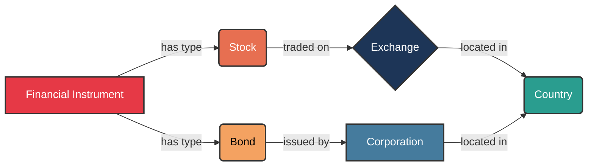
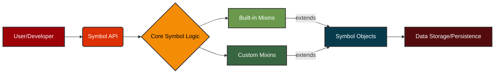

# `«symbol»` Affect

## Catalyzing Value and Unifying Knowledge

## Empowering Innovation Through Semantic Precision and Seamless Integration

In today's rapidly evolving technological landscape, the ability to precisely define, manage, and integrate complex concepts is paramount for driving innovation and maintaining a competitive edge. The Symbol framework addresses this critical need by providing a principled approach to representing and manipulating knowledge within software systems. By offering a robust foundation for semantic modeling, Symbol empowers organizations to:

*   **Accelerate Value Creation:** Streamline the development of sophisticated applications by providing a clear, unambiguous way to define and relate domain-specific concepts. This reduces development cycles, minimizes errors, and allows teams to focus on delivering core business logic rather than wrestling with data inconsistencies.
*   **Ensure Seamless Integration:** Facilitate effortless interoperability between disparate systems and data sources. Symbol's emphasis on canonical representation and well-defined relationships ensures that information can flow freely and accurately across organizational boundaries, breaking down data silos and fostering a unified view of critical assets.
*   **Generalize and Unify Knowledge:** Transcend the limitations of rigid, application-specific data models. By enabling the creation of a flexible, extensible knowledge graph, Symbol allows for the generalization of concepts and their relationships, fostering a holistic understanding of complex domains. This unified knowledge base becomes a strategic asset, enabling advanced analytics, intelligent automation, and the development of novel solutions that leverage interconnected insights.

## Example: Compact Graph Representation

The Symbol framework excels at representing intricate relationships in a concise and human-readable format. Consider the following example, demonstrating a compact graph of interconnected concepts:

## Business Impact of a Symbol Domain-Specific Language (DSL)

The adoption of a Symbol-based Domain-Specific Language (DSL) can yield significant business advantages:

*   **Increased Agility:** Rapidly adapt to changing business requirements by modifying the DSL rather than rewriting extensive application code. This accelerates time-to-market for new features and products.
*   **Reduced Development Costs:** Empower domain experts to directly contribute to system logic through the intuitive DSL, minimizing the need for constant developer intervention. This frees up engineering resources for more complex architectural challenges.
*   **Improved Communication and Collaboration:** Foster a shared understanding between business stakeholders and technical teams. The DSL acts as a common language, reducing misinterpretations and ensuring that implemented solutions accurately reflect business intent.
*   **Enhanced Maintainability and Scalability:** Create self-documenting systems where the business logic is explicitly captured in the DSL. This simplifies maintenance, reduces technical debt, and allows for easier scaling of operations.
*   **Greater Data Consistency and Quality:** Enforce semantic rules and constraints directly within the DSL, leading to higher data quality and reduced errors across integrated systems.

## Developer Friendly Interface

## Conclusion

The Symbol framework offers a compelling proposition for organizations seeking to enhance their software development capabilities through semantic precision, seamless integration, and unified knowledge representation. By embracing a Symbol-based approach, a wide variety of organizations can unlock new levels of agility, reduce operational costs, and foster a collaborative environment conducive to innovation.

## Further Documentation

### Guides 📚
* [1_quick_guide.md](docs/guides/1_quick_guide.md) (200 lines) 🚀
  A brief, high-level introduction to the core concepts of the Symbol framework, including interning, graph representation, and mixin-based extensibility. Ideal for quickly grasping the foundational principles.

  This guide provides a rapid overview for researchers and practitioners, focusing on immediate utility and key considerations for building symbolic systems.

* [2_introduction.md](docs/guides/2_introduction.md) (250 lines) 📖
  Provides a comprehensive introduction to the `Symbol` library, guiding users through its fundamental concepts and practical applications. It demonstrates how `Symbol` facilitates the creation of clear, maintainable, and extensible symbolic models.

  This tutorial is designed for a broad audience, including software engineers, data scientists, and domain experts seeking to leverage symbolic representation in their projects.

* [3_tutorial.md](docs/guides/3_tutorial.md) (300 lines) 🎓
  Delves into the sophisticated capabilities of the `Symbol` library, showcasing its versatility in addressing complex modeling challenges. It explores advanced features such as custom mixin development, intricate graph manipulations, and strategic application for DSL construction.

  This guide aims to empower experienced developers and researchers to unlock the full potential of `Symbol` for highly specialized and performant symbolic systems.

* [4_schedule_and_batch_processing_api_documentation.md](docs/guides/4_schedule_and_batch_processing_api_documentation.md) (100 lines) ⏱️
  Provides detailed API documentation for the `symbol.core.batch_processing` and `symbol.core.schedule` modules. It outlines functions for asynchronous and synchronous batch processing, and classes for managing scheduled jobs.

  This document is essential for developers looking to integrate batch processing and task scheduling functionalities into their `Symbol`-based applications.

### Cookbook 🧑‍🍳
* [0_table_of_contents.md](docs/cookbook/0_table_of_contents.md) (50 lines) 📜
  The central table of contents for the Symbol Cookbook, offering practical recipes and examples for common implementation challenges. It serves as a structured entry point for developers seeking hands-on solutions.

  This document outlines various how-to guides, from creating custom mixins to scheduling jobs, making it an invaluable resource for practical application of the Symbol framework.

* [1_mixin_recipe/1_essence_of_mixins.md](docs/cookbook/1_mixin_recipe/1_essence_of_mixins.md) (100 lines) 🧪
  Explores the fundamental concept of mixins in the `symbol` framework, highlighting their role in extending `Symbol` object functionality without traditional inheritance. It emphasizes modularity, reusability, and dynamic extension.

  This document provides a foundational understanding of why mixins are adopted in `symbol` and how they contribute to a flexible, scalable, and maintainable symbolic framework.

* [1_mixin_recipe/2_anatomy_of_a_mixin.md](docs/cookbook/1_mixin_recipe/2_anatomy_of_a_mixin.md) (150 lines) 🧬
  Details the internal structure and expected protocols of a mixin within the `symbol` framework. It covers core components like initialization, methods, and properties, and emphasizes the use of `typing.Protocol` for type safety.

  This document is crucial for developers aiming to create robust and well-integrated extensions, ensuring adherence to established protocols and leveraging mixin validation mechanisms.

* [1_mixin_recipe/3_implementing_your_first_mixin.md](docs/cookbook/1_mixin_recipe/3_implementing_your_first_mixin.md) (150 lines) 🛠️
  Provides a practical, step-by-step example of creating a simple mixin for the `symbol` framework. It demonstrates how to define a mixin class and apply it to a `Symbol` instance to add new capabilities.

  This guide is ideal for hands-on learning, illustrating the basic process of extending `Symbol` objects with custom behaviors and preparing for subsequent testing and documentation.

* [1_mixin_recipe/4_testing_your_mixin.md](docs/cookbook/1_mixin_recipe/4_testing_your_mixin.md) (200 lines) 🎯
  Outlines best practices for thoroughly testing mixins within the `symbol` framework, covering both synchronous and asynchronous functionalities. It emphasizes isolation, integration, and edge case testing.

  This document provides a practical example of creating a test file using `pytest` and `anyio`, ensuring the correctness, reliability, and proper integration of custom mixins.

* [1_mixin_recipe/5_documenting_your_mixin.md](docs/cookbook/1_mixin_recipe/5_documenting_your_mixin.md) (150 lines) ✍️
  Highlights the importance of effective documentation for mixins, covering key elements such as docstrings, type hints, and example usage. It emphasizes clarity, usability, and maintainability.

  This document guides developers in creating comprehensive documentation that helps others understand what a mixin does, how to use it, and its specific considerations, fostering collaboration and long-term usability.

* [1_mixin_recipe/6_publishing_your_mixin.md](docs/cookbook/1_mixin_recipe/6_publishing_your_mixin.md) (200 lines) 📦
  Outlines the process of publishing a `symbol` mixin, from sharing it as a third-party package on PyPI to potentially integrating it into the `symbol` standard library. It covers project structure, `pyproject.toml`, and `twine`.

  This document provides essential guidance for making mixins available to a wider audience, detailing the steps for packaging, distribution, and contributing to the core `symbol` project.

* [2_scheduling_jobs.md](docs/cookbook/2_scheduling_jobs.md) (200 lines) ⏰
  Demonstrates how to use the `symbol.schedule` module to schedule and manage jobs within `symbol` applications. It covers basic usage, job management, and persisting schedules.

  This recipe provides practical examples and diagrams for automating tasks and orchestrating workflows, making it a valuable resource for integrating scheduling capabilities.

### Development ⚙️
* [architecture.md](docs/development/architecture.md) (150 lines) 🏗️
  Provides a detailed overview of the `symbol` library's architecture, including its core components and layered structure. It explains how the framework separates concerns to promote modularity and extensibility.

  This document is essential for contributors and architects interested in the internal workings, dependencies, and design principles that guide the development of the `symbol` framework.

* [conversion_to_and_from.md](docs/development/conversion_to_and_from.md) (200 lines) 🔄
  Outlines the mechanisms for converting standard Python types to `Symbol` objects and vice-versa, enhancing the framework's interoperability and ease of use. It covers primitive and collection types, and nested conversions.

  This document provides comprehensive examples of `Symbol.from_<type>` class methods and the `to_sym()` global function, illustrating seamless data integration.

* [directory_validation_lr.mmd](docs/development/directory_validation_lr.mmd) (20 lines) 🗺️
  A Mermaid diagram illustrating the architecture of a directory validation system, focusing on its components and their interactions in a left-to-right flow.

  This visual aid helps in understanding the system's structure, including matching engines, project detection, learning analytics, and performance caching.

* [directory_validation_tb.mmd](docs/development/directory_validation_tb.mmd) (20 lines) 🧭
  A Mermaid diagram illustrating the architecture of a directory validation system, focusing on its components and their interactions in a top-to-bottom flow.

  This visual aid helps in understanding the system's structure, including matching engines, project detection, learning analytics, and performance caching.

* [glossary.md](docs/development/glossary.md) (50 lines) 📖
  Provides a comprehensive overview of the design, arithmetic, and algorithmic patterns employed throughout the Symbol project. It defines key terms and concepts for better understanding.

  This document is beneficial for all users, especially when encountering unfamiliar terminology related to the framework's architecture, mixinability, and data-centric design.

* [good_to_know.md](docs/development/good_to_know.md) (100 lines) 💡
  Highlights various insights and resolutions for common issues encountered during the development of the `symbol` framework. It covers topics like callable weight evaluation, argument mismatches, and non-deterministic Mermaid output.

  This document serves as a valuable resource for debugging and understanding specific design choices and their implications within the `symbol` codebase.

* [module_paths_diagram.md](docs/development/module_paths_diagram.md) (50 lines) 🛣️
  Illustrates the most direct import paths to each accessible module in the `symbol` library using a Mermaid diagram. It provides a clear overview of the library's public API and component access.

  This visual guide helps developers understand the modular structure and how to import various core and builtin extension modules within their projects.

* [namespace_dsl_spec.md](docs/development/namespace_dsl_spec.md) (100 lines) 📝
  Details the design and implementation of `symbol.py` as a lazy, graph-oriented, immutable symbol system, serving as a foundational primitive for domain-specific languages (DSLs).

  This document covers core components, relations, highlights, render pipelines, and performance characteristics, providing a comprehensive overview of the DSL capabilities.

* [notations.md](docs/development/notations.md) (200 lines) 📊
  Provides empirical validation of the Big O notations asserted for key operations within the `Symbol` framework. It includes detailed measurements and analysis of time and space complexity.

  This document is crucial for understanding the performance characteristics of `Symbol` operations, such as instantiation, relationship linking, and indexed operations, with insights into potentially slow callables.

* [package_publish.md](docs/development/package_publish.md) (150 lines) 🚀
  Provides detailed instructions on how to build and publish the `symbol` package to PyPI (Python Package Index) using `uv` and `twine`. It covers prerequisites, publication steps, and troubleshooting.

  This guide is essential for maintainers and contributors responsible for releasing new versions of the `symbol` library, ensuring a smooth and secure publication process.

* [structure_overview.md](docs/development/structure_overview.md) (100 lines) 🏛️
  Outlines the project's organizational structure, dividing it into `symbol.core` (essential components) and `symbol.builtins` (optional, high-level extensions). It includes Mermaid diagrams for visual clarity.

  This document helps developers understand the modular design and the separation of concerns within the `symbol` library, facilitating navigation and contribution.

### Paper 📝
* [A_Principled_Framework.md](docs/paper/A_Principled_Framework.md) (250 lines) 🎓
  A comprehensive academic paper introducing the `«symbol»` framework, detailing its design principles, architectural layers, and key operations. It includes case studies from the integrated circuit manufacturing domain.

  This document provides a theoretical foundation and empirical evidence for `«symbol»`'s efficacy in dynamic symbolic computation and knowledge graph construction, discussing performance and future research avenues.

### Topics 💡
* [1_symbol_fundamental_building_block/index.md](docs/topics/1_symbol_fundamental_building_block/index.md) (200 lines) 🧱
  Explores the `Symbol` object as the atomic unit of the framework, detailing its uniqueness through interning and its role as a node in a dynamic, directed acyclic graph. It covers efficient relationship management and extensibility.

  This document provides a foundational understanding of how `Symbol` instances form the basis for complex data structures and symbolic manipulation tasks, with examples in supply chain modeling and knowledge graphs.

* [1_symbol_fundamental_building_block/symbol_relationships.mmd](docs/topics/1_symbol_fundamental_building_block/symbol_relationships.mmd) (20 lines) 🔗
  A Mermaid diagram illustrating the core relationships within a `Symbol` object, including children, parents, `related_to`, and `related_how`.

  This visual aid helps in understanding how `Symbol` instances connect to form complex graph structures and represent semantic information.

* [10_memory_awareness/index.md](docs/topics/10_memory_awareness/index.md) (150 lines) 🧠
  Details the `Symbol` framework's meticulous design for memory efficiency, covering GC-aware deletion, proactive memory management for the `context` attribute via `deep_del`, and the `MEMORY_AWARE_DELETE` flag.

  This document explains how `Symbol` minimizes its memory footprint and ensures robust, predictable behavior in large-scale, interconnected systems.

* [10_memory_awareness/memory_awareness_overview.mmd](docs/topics/10_memory_awareness/memory_awareness_overview.mmd) (20 lines) 📊
  A Mermaid diagram providing a comprehensive overview of the `Symbol`'s memory awareness mechanisms, including GC-aware deletion, proactive context cleanup, and the maturing process.

  This visual aid helps in understanding the various strategies employed to minimize memory footprint and ensure efficient resource management.

* [11_extensibility/extensibility_overview.mmd](docs/topics/11_extensibility/extensibility_overview.mmd) (20 lines) 🧩
  A Mermaid diagram illustrating the `Symbol` framework's extensibility mechanisms, including the `Symbolable` protocol, `MixinFunction` protocol, `SymbolAdapter` concept, enum reflection compatibility, and external DSL input.

  This visual aid helps in understanding how `Symbol` can be adapted and integrated into a wide array of applications and domains.

* [11_extensibility/index.md](docs/topics/11_extensibility/index.md) (200 lines) 🔌
  Explores the `Symbol` framework's strong emphasis on extensibility, detailing how it adapts to diverse domains through well-defined protocols, dynamic mixin capabilities, and compatibility with external data formats.

  This document covers the `Symbolable` type for robust callable integration, `MixinFunction` protocol for formal mixin interfaces, and compatibility with enum reflection and external DSL inputs.

* [12_example_use/index.md](docs/topics/12_example_use/index.md) (250 lines) 💡
  Illustrates several practical use cases of the `Symbol` framework, demonstrating how its core features can be leveraged to solve real-world problems. Examples include basic symbol creation, ESG tracking, timeline management, batch processing, and scheduling.

  This document provides concrete examples and diagrams, showcasing the versatility and power of `Symbol` in various application domains.

* [13_conclusion/index.md](docs/topics/13_conclusion/index.md) (100 lines) ✅
  Summarizes the `Symbol` framework as a high-performance, semantically rich, and thread-safe symbol abstraction. It highlights its role as a robust foundation for building DSLs, runtime graphs, and knowledge trees.

  This document emphasizes the core design principles of structural clarity, cache efficiency, and symbolic extensibility, positioning `Symbol` as a valuable tool for modern software engineering challenges.

* [2_flyweight_design/flyweight_pattern.mmd](docs/topics/2_flyweight_design/flyweight_pattern.mmd) (20 lines) 🪶
  A Mermaid diagram illustrating the Flyweight design pattern as applied to `Symbol` instantiation, showing how a central pool ensures uniqueness and efficiency.

  This visual aid helps in understanding the memory optimization and consistent identity achieved through this pattern.

* [2_flyweight_design/index.md](docs/topics/2_flyweight_design/index.md) (100 lines) 🪶
  Explains how the `Symbol` framework leverages the Flyweight design pattern to ensure the uniqueness and efficient management of `Symbol` instances. It details the core principle of shared intrinsic state and its advantages.

  This document provides code examples and industry applications, demonstrating how Flyweight contributes to memory efficiency, consistency, and performance in `Symbol`.

* [3_layered_architecture/index.md](docs/topics/3_layered_architecture/index.md) (100 lines) 🏗️
  Describes the `Symbol` framework's layered architecture, separating concerns into `symbol.core` (essential building blocks) and `symbol.builtins` (optional, high-level extensions).

  This document explains how this design ensures a lean and stable core while allowing for flexible and modular extension of functionalities, with code examples and industry applications.

* [3_layered_architecture/layered_architecture-lr.mmd](docs/topics/3_layered_architecture/layered_architecture-lr.mmd) (20 lines) 📐
  A Mermaid diagram illustrating the `Symbol` framework's layered architecture in a left-to-right flow, distinguishing between the core and builtin extension layers.

  This visual aid helps in understanding the modularity and controlled dependencies within the framework.

* [3_layered_architecture/layered_architecture_tb.mmd](docs/topics/3_layered_architecture/layered_architecture_tb.mmd) (20 lines) 📏
  A Mermaid diagram illustrating the `Symbol` framework's layered architecture in a top-to-bottom flow, distinguishing between the core and builtin extension layers.

  This visual aid helps in understanding the modularity and controlled dependencies within the framework.

* [4_per_instance_indexing/index.md](docs/topics/4_per_instance_indexing/index.md) (150 lines) 🗂️
  Introduces the concept of per-instance indexing in the `Symbol` framework, where each `Symbol` object possesses its own private, weighted index of other symbols. It details the `SymbolIndex` mechanism.

  This document explains how this feature enables the creation and efficient management of sophisticated, nested data structures, with code examples and industry applications.

* [4_per_instance_indexing/per_instance_indexing.mmd](docs/topics/4_per_instance_indexing/per_instance_indexing.mmd) (20 lines) 📈
  A Mermaid diagram illustrating the per-instance indexing mechanism, showing how a `Symbol` instance owns a private `SymbolIndex` that references other symbols with associated weights.

  This visual aid helps in understanding the localized, internal data storage for complex, contextual associations.

* [5_mixinability/index.md](docs/topics/5_mixinability/index.md) (200 lines) 🧩
  Describes the `Symbol` framework's sophisticated mixinability mechanism, enabling the dynamic extension of `Symbol` instances at runtime. It covers dynamic extension, validation, and the freezing mechanism.

  This document provides illustrative examples and diagrams, showcasing how mixinability contributes to building highly adaptable and modular systems.

* [5_mixinability/mixinability_flow.mmd](docs/topics/5_mixinability/mixinability_flow.mmd) (20 lines) 🔄
  A Mermaid diagram illustrating the flow of mixin application in the `Symbol` framework, including the validation process and the outcomes of successful or rejected registrations.

  This visual aid helps in understanding how new functionalities are dynamically attached to `Symbol` instances.

* [6_memory_aware_maturing/index.md](docs/topics/6_memory_aware_maturing/index.md) (150 lines) ♻️
  Explains the `Symbol` framework's "maturing" process, orchestrated by the `immute()` method, designed to optimize memory footprint and performance. It details the elevate, slim, and freeze phases.

  This document provides examples and diagrams, demonstrating how maturing transitions `Symbol` instances from a flexible to an optimized, immutable form.

* [6_memory_aware_maturing/maturing_process.mmd](docs/topics/6_memory_aware_maturing/maturing_process.mmd) (20 lines) ⏳
  A Mermaid diagram illustrating the memory-aware maturing process (`immute()`), showing the sequential execution of `elevate()`, `slim()`, and `freeze()`.

  This visual aid helps in understanding the optimization steps for `Symbol` instances.

* [6_memory_aware_maturing/maturing_process_2.mmd](docs/topics/6_memory_aware_maturing/maturing_process_2.mmd) (20 lines) ⚙️
  A Mermaid diagram detailing the internal mechanisms involved in the memory-aware maturing process, such as `Symbol.metadata`, `deep_del()`, `gc.collect()`, and `_apply_merge_strategy()`.

  This visual aid helps in understanding the technical underpinnings of memory optimization.

* [6_memory_aware_maturing/maturing_process_3.mmd](docs/topics/6_memory_aware_maturing/maturing_process_3.mmd) (20 lines) ✨
  A Mermaid diagram highlighting the benefits of the memory-aware maturing process, including reduced memory footprint, improved performance, stability, and clear lifecycle management.

  This visual aid helps in understanding the advantages gained from optimizing `Symbol` instances.

* [7_scheduling/index.md](docs/topics/7_scheduling/index.md) (200 lines) 📅
  Integrates a robust scheduling mechanism into the `Symbol` framework, enabling deferred and automated task execution. It covers `ScheduledJob` and `Scheduler` components.

  This document provides illustrative examples and diagrams for microservice orchestration and automated report generation, showcasing flexible scheduling paradigms.

* [7_scheduling/scheduling_flow.mmd](docs/topics/7_scheduling/scheduling_flow.mmd) (20 lines) ➡️
  A Mermaid diagram illustrating the `Symbol` scheduling mechanism, showing how `ScheduledJob` instances are added to a min-heap, monitored by the `Scheduler`, and executed.

  This visual aid helps in understanding the flow of task automation and job management.

* [8_api_highlights/api_overview.mmd](docs/topics/8_api_highlights/api_overview.mmd) (20 lines) 🌟
  A Mermaid diagram providing a comprehensive overview of the `Symbol` API highlights, categorizing methods by core constructors, relationship management, traversal, lifecycle management, visualization, and utility.

  This visual aid helps in quickly grasping the breadth of `Symbol`'s functionality.

* [8_api_highlights/index.md](docs/topics/8_api_highlights/index.md) (300 lines) 💡
  Details the key methods and properties that form the backbone of the `Symbol` framework's functionality. It covers `Symbol()` constructor, `Symbol.next()`, `append()`, `relate_to()`, traversal methods, `patch()`, visualization, `delete()`, `elevate()`, `slim()`, `immute()`, `ref`, and `Scheduler.add_job()`.

  This document offers insights into their design principles and practical applications, with code examples and diagrams.

* [9_performance/index.md](docs/topics/9_performance/index.md) (200 lines) ⚡
  Explains how the `Symbol` framework is engineered for high performance, detailing algorithmic and architectural optimizations for efficient instantiation, relationship management, and traversal.

  This document covers O(1) symbol instantiation (intern pool), O(1) relationship linking, O(1) traversal with cache, and O(log n) insert/search with bisect-based insertion order, with code examples and diagrams.

* [9_performance/performance_overview.mmd](docs/topics/9_performance/performance_overview.mmd) (20 lines) 🚀
  A Mermaid diagram providing a comprehensive overview of the `Symbol`'s performance characteristics, including O(1) instantiation, O(1) linking, O(1) cached traversal, and O(log n) indexed operations.

  This visual aid helps in understanding the underlying mechanisms that contribute to `Symbol`'s favorable time complexities.

