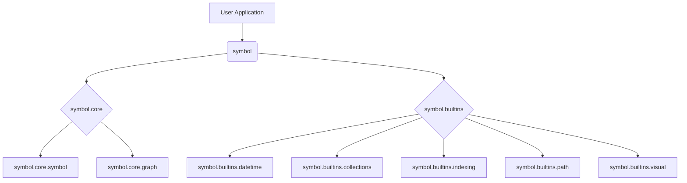

**Symbol** is a Python framework for creating, manipulating, and analyzing complex, graph-based data structures. It provides a versatile `Symbol` object that serves as a node in a dynamic, directed acyclic graph (DAG). The framework is designed to be lean, modular, and extensible, making it suitable for a wide range of applications, from data science and AI to domain-specific modeling.

# «symbol» namespace dsl

> `symbol.py` — A Lazy, Graph-Oriented, Immutable Symbol System for Domain-Specific Abstraction

_inspired by ruby's [symbol](https://ruby-doc.org/core-2.5.3/Symbol.html)_

## Core Concepts

-   **Symbol**: The fundamental building block. Each symbol has a unique name and can be connected to other symbols, forming complex relationships.
-   **Flyweight Design**: Symbols are unique. `Symbol('a')` will always return the same object, saving memory and ensuring consistency.
-   **Layered Architecture**: The core is minimal. Functionality is added through modular, "builtin" extensions for features like date/time handling, advanced collections, and visualization.
-   **Per-Instance Indexing**: Every symbol has its own private, weighted index of other symbols, allowing for the creation of sophisticated, nested data structures.


API Highlights:
---------------
- `Symbol(name: str)` — globally interned, idempotent constructor
- `Symbol.next()` — creates and chains auto-numbered symbol (`sym_0`, `sym_1`, …)
- `symbol.append(child)` / `symbol.relate_to(other, how)` — link construction
- `symbol.tree()` / `.que()` / `.relate()` — lazy traversal
- `symbol.patch(other)` — recursive, structural deep merge (PATCH-like semantics)
- `symbol.to_mmd()` — outputs tree graph in Mermaid diagram syntax
- `symbol.delete()` — removes node and its inverse references (parents/children)

Performance:
------------
- O(1) symbol instantiation (intern pool)
- O(1) relationship linking
- O(1) traversal with cache and float-based cursor insertion
- O(log n) insert/search when extended to use bisect-based insertion order

Memory Awareness:
-----------------
- GC-compatible deletion with optional `origin` retention
- `ENABLE_ORIGIN` and `MEMORY_AWARE_DELETE` flags allow granular control
- Optional `Symbol.origin` to track source provenance

Extensibility:
--------------
- Easily extended with async traversal, typed relations, or backend persistence
- `SymbolAdapter` mixinable interface enables different logical structures
- Compatible with enum reflection and external DSL inputs

Example Use:
------------
```python
s = SymbolNamespace()

s.backend.relate_to(s.database, how=s.uses)
s.page.append(s.header).append(s.footer)

print(s.page.tree())    # Traverse children
print(s.page.to_mmd())  # Render as Mermaid diagram
```

Conclusion:
-----------
This module provides a high-performance, semantically rich, thread-safe symbol abstraction to power DSLs, runtime graphs, knowledge trees, and dynamic semantic layers. The design emphasizes structural clarity, cache efficiency, and symbolic extensibility.


## Project Structure

The project is organized into two main packages:

-   `symbol.core`: Contains the essential `Symbol` class and graph traversal logic.
-   `symbol.builtins`: Provides optional, high-level extensions for collections, date/time operations, indexing, pathfinding, and visualization.



## ESG Example: Tracking Deforestation in a Supply Chain

Here, we use `Symbol` to model a supply chain and identify products linked to deforestation.

```python
from symbol import s

# --- Define our supply chain entities ---
s.Global_Goods_Inc.buys_from(s.Palm_Oil_Processor)
s.Palm_Oil_Processor.buys_from(s.Supplier_A)
s.Palm_Oil_Processor.buys_from(s.Supplier_B)

s.Supplier_A.sources_from(s.Plantation_X)
s.Supplier_B.sources_from(s.Plantation_Y)

# --- Add deforestation data (hypothetical) ---
s.Plantation_Y.add(s.deforestation_event_2024_Q4)

# --- Now, let's find the tainted products ---
def has_deforestation(symbol):
    return 'deforestation' in symbol.name

# Find all paths from the company to a deforestation event
for path in s.Global_Goods_Inc.match(has_deforestation):
    print(f"Deforestation Link Found: {path.path_to(s.deforestation_event_2024_Q4)}")

```

This example demonstrates how the graph structure can be used to trace complex relationships and identify risks within a system.

## Getting Started

To begin, simply import the `Symbol` or `S` namespace factory:

```python
from symbol import Symbol, s

# Create symbols
hello = Symbol('hello')
world = s.world

# Build relationships
hello.add(world)

# Traverse the graph
print(hello.tree())

# Symbol: A Framework for Symbolic Data Manipulation
```

---
