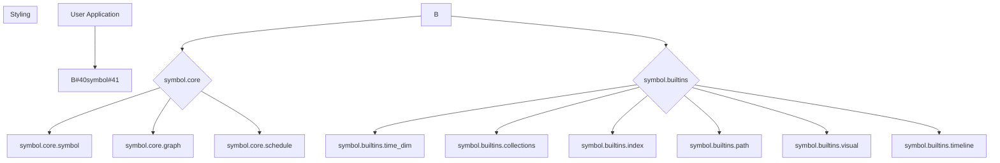
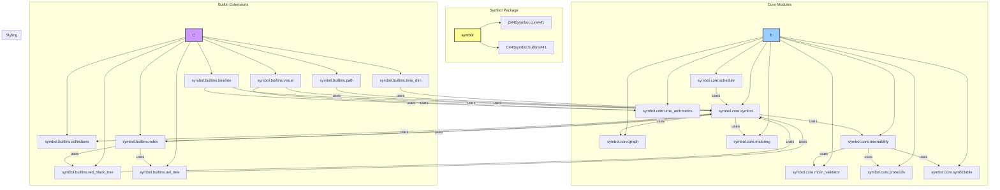

# `«symbol»`
**A Framework for Symbolic Data Manipulation**

_inspired by ruby's [symbol](https://ruby-doc.org/core-2.5.3/Symbol.html)_

> `symbol.py` — A Lazy, Graph-Oriented, Immutable Symbol System Concept for Domain-Specific Abstraction

## What is Symbol?

**Symbol** is a namespace fsl, where dsl means (domain specific language). It is a Python framework for creating, manipulating, and analyzing complex, graph-based data structures. It provides a versatile `Symbol` object that serves as a node in a dynamic, directed acyclic graph (DAG). The framework is designed to be lean, modular, and extensible, making it suitable for a wide range of applications, from data science and AI to domain-specific modeling.


## Core Concepts

-   **`«symbol»`**: The fundamental building block. Each symbol has a unique name and can be connected to other symbols, forming complex relationships.
-   **Flyweight Design**: Symbols are unique. `Symbol('a')` will always return the same object, saving memory and ensuring consistency.
-   **Layered Architecture**: The core is minimal. Functionality is added through modular, "builtin" extensions for features like date/time handling, advanced collections, and visualization.
-   **Per-Instance Indexing**: Every symbol has its own private, weighted index of other symbols, allowing for the creation of sophisticated, nested data structures.
-   **[Mixinability](docs/readme_details/5_mixinability/index.md)**: The framework supports dynamic extension of `Symbol` instances at runtime through mixins, which are validated for robustness.
-   **[Memory-Aware Maturing](docs/readme_details/6_memory_aware_maturing/index.md)**: Symbols can be "matured" to optimize memory usage and performance by elevating metadata and removing unused components.
-   **[Scheduling](docs/readme_details/7_scheduling/index.md)**: A built-in scheduler allows for deferred execution of functions and methods, specified with cron-like strings, datetime objects, or even other Symbols.

API Highlights:
---------------
- **[Symbol(name: str)](docs/readme_details/8_api_highlights/index.md#symbolname-str-globally-interned-idempotent-constructor)** — globally interned, idempotent constructor
- **[Symbol.next()](docs/readme_details/8_api_highlights/index.md#symbolnext-creates-and-chains-auto-numbered-symbols)** — creates and chains auto-numbered symbol (`sym_0`, `sym_1`, …)
- **[symbol.append(child) / symbol.relate_to(other, how)](docs/readme_details/8_api_highlights/index.md#symbolappendchild--symbolrelate_toother-how-link-construction)** — link construction
- **[symbol.tree() / .que() / .relate()](docs/readme_details/8_api_highlights/index.md#symboltree--que--relate-lazy-traversal)** — lazy traversal
- **[symbol.patch(other)](docs/readme_details/8_api_highlights/index.md#symbolpatchother-recursive-structural-deep-merge)** — recursive, structural deep merge (PATCH-like semantics)
- **[symbol.to_mmd()](docs/readme_details/8_api_highlights/index.md#symbolto_mmd-outputs-tree-graph-in-mermaid-diagram-syntax)** — outputs tree graph in Mermaid diagram syntax
- **[symbol.to_ascii()](docs/readme_details/8_api_highlights/index.md#symbolto_ascii-outputs-ascii-art-representation-of-graphs)** — outputs ASCII art representation of graphs
- **[symbol.delete()](docs/readme_details/8_api_highlights/index.md#symboldelete-removes-node-and-its-inverse-references)** — removes node and its inverse references (parents/children)
- **[symbol.elevate()](docs/readme_details/8_api_highlights/index.md#symbolelevate-promotes-metadata-to-instance-attributesmethods)** — promotes metadata to instance attributes/methods
- **[symbol.slim()](docs/readme_details/8_api_highlights/index.md#symbolslim-removes-unused-dynamically-applied-mixins)** — removes unused dynamically applied mixins
- **[symbol.immute()](docs/readme_details/8_api_highlights/index.md#symbolimmute-orchestrates-maturing-process-elevate-slim-freeze)** — orchestrates maturing process (elevate, slim, freeze)
- **[symbol.ref](docs/readme_details/8_api_highlights/index.md#symbolref-alias-for-symbolorigin-to-track-source-provenance)** — alias for `symbol.origin` to track source provenance
- **[Scheduler.add_job(job)](docs/readme_details/8_api_highlights/index.md#scheduleradd_jobjob-schedules-a-new-job-for-execution)** — schedules a new job for execution

Performance:
------------
For detailed performance analysis and empirical validation of Big O notations, refer to the [Performance Notations and Empirical Validation](docs/notations.md) document.

- O(1) symbol instantiation (intern pool)
- O(1) relationship linking
- O(1) traversal with cache and float-based cursor insertion
- O(log n) insert/search when extended to use bisect-based insertion order

Memory Awareness:
-----------------
-   **[Memory Awareness](docs/readme_details/10_memory_awareness/index.md)**: GC-aware deletion (respecting `ENABLE_ORIGIN`, `MEMORY_AWARE_DELETE`)
-   Proactive memory management for `context` attribute via `deep_del`

Extensibility:
--------------
- Easily extended with async traversal, typed relations, or backend persistence
- `Symbolable` type for robust callable integration
- `MixinFunction` protocol for formal mixin interface
- `SymbolAdapter` mixinable interface enables different logical structures
- Compatible with enum reflection and external DSL inputs

Example Use:
------------
- **[Practical Applications](docs/readme_details/12_example_use/index.md)**: Demonstrates how Symbol's core features can be leveraged to solve real-world problems.

Conclusion:
-----------
- **[Overview](docs/readme_details/13_conclusion/index.md)**: This module provides a high-performance, semantically rich, thread-safe symbol abstraction to power DSLs, runtime graphs, knowledge trees, and dynamic semantic layers. The design emphasizes structural clarity, cache efficiency, and symbolic extensibility.

## Project Structure

The project is organized into two main packages:

-   `symbol.core`: Contains the essential `Symbol` class and graph traversal logic.
-   `symbol.builtins`: Provides optional, high-level extensions for collections, date/time operations, index, pathfinding, and visualization.


    style A fill:#9400D3,stroke:#333,stroke-width:2px,color:#FFFFFF;
    style B fill:#ADFF2F,stroke:#333,stroke-width:2px,color:#000000;
    style C fill:#BDB76B,stroke:#333,stroke-width:2px,color:#000000;
    style D fill:#ADFF2F,stroke:#333,stroke-width:2px,color:#000000;

## Software Architecture



## Getting Started

To begin, simply import the `Symbol` or `s` namespace factory:

```python
from symbol import Symbol, s

# Create symbols
hello = Symbol('hello')
world = s.world

# Build relationships
hello.add(world)

# Traverse the graph
print(hello.tree())

```

## Running Tests

To run all tests, execute the following command from the project root directory:

```bash
python -m pytest tests
```
