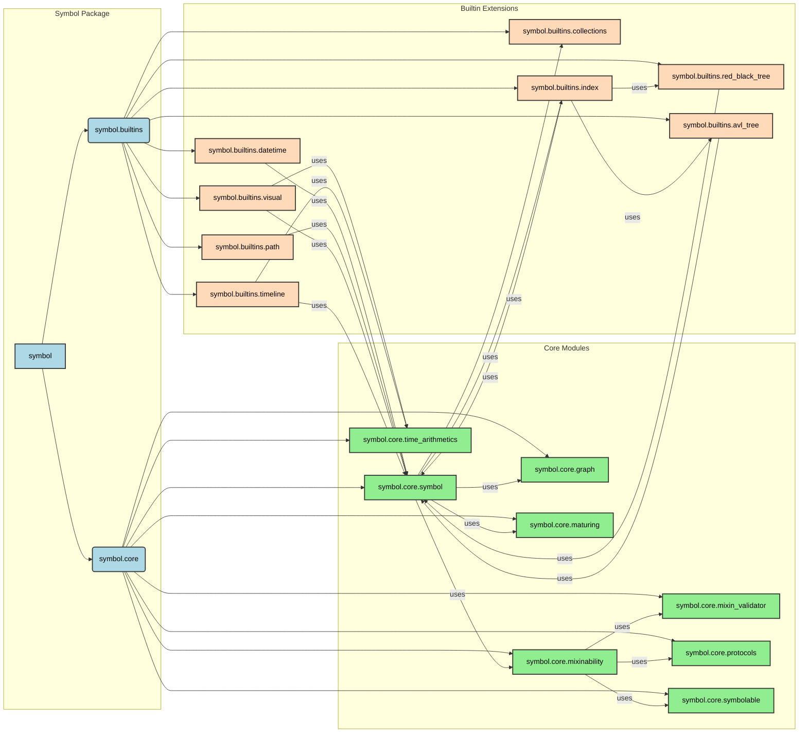

# Software Architecture Overview

```mermaid
graph LR
    subgraph Symbol Package
        A[symbol] --> B(symbol.core)
        A --> C(symbol.builtins)
    end

    subgraph Core Modules
        B --> B1[symbol.core.symbol]
        B --> B2[symbol.core.graph]
        B --> B3[symbol.core.maturing]
        B --> B4[symbol.core.mixinability]
        B --> B5[symbol.core.mixin_validator]
        B --> B6[symbol.core.protocols]
        B --> B7[symbol.core.symbolable]
        B --> B8[symbol.core.time_arithmetics]
    end

    subgraph Builtin Extensions
        C --> C1[symbol.builtins.collections]
        C --> C2[symbol.builtins.datetime]
        C --> C3[symbol.builtins.index]
        C --> C4[symbol.builtins.path]
        C --> C5[symbol.builtins.visual]
        C --> C6[symbol.builtins.red_black_tree]
        C --> C7[symbol.builtins.avl_tree]
        C --> C8[symbol.builtins.timeline]
    end

    B1 -- uses --> B2
    B1 -- uses --> B3
    B1 -- uses --> B4
    B1 -- uses --> C1
    B1 -- uses --> C3

    B4 -- uses --> B5
    B4 -- uses --> B6
    B4 -- uses --> B7

    C2 -- uses --> B1
    C3 -- uses --> B1
    C4 -- uses --> B1
    C5 -- uses --> B1
    C6 -- uses --> B1
    C7 -- uses --> B1
    C8 -- uses --> B1

    C3 -- uses --> C6
    C3 -- uses --> C7

    C5 -- uses --> B8
    C8 -- uses --> B8

    style A fill:#ADD8E6,stroke:#333,stroke-width:2px,color:#000000
    style B fill:#ADD8E6,stroke:#333,stroke-width:2px,color:#000000
    style C fill:#ADD8E6,stroke:#333,stroke-width:2px,color:#000000

    style B1 fill:#90EE90,stroke:#333,stroke-width:2px,color:#000000
    style B2 fill:#90EE90,stroke:#333,stroke-width:2px,color:#000000
    style B3 fill:#90EE90,stroke:#333,stroke-width:2px,color:#000000
    style B4 fill:#90EE90,stroke:#333,stroke-width:2px,color:#000000
    style B5 fill:#90EE90,stroke:#333,stroke-width:2px,color:#000000
    style B6 fill:#90EE90,stroke:#333,stroke-width:2px,color:#000000
    style B7 fill:#90EE90,stroke:#333,stroke-width:2px,color:#000000
    style B8 fill:#90EE90,stroke:#333,stroke-width:2px,color:#000000

    style C1 fill:#FFDAB9,stroke:#333,stroke-width:2px,color:#000000
    style C2 fill:#FFDAB9,stroke:#333,stroke-width:2px,color:#000000
    style C3 fill:#FFDAB9,stroke:#333,stroke-width:2px,color:#000000
    style C4 fill:#FFDAB9,stroke:#333,stroke-width:2px,color:#000000
    style C5 fill:#FFDAB9,stroke:#333,stroke-width:2px,color:#000000
    style C6 fill:#FFDAB9,stroke:#333,stroke-width:2px,color:#000000
    style C7 fill:#FFDAB9,stroke:#333,stroke-width:2px,color:#000000
    style C8 fill:#FFDAB9,stroke:#333,stroke-width:2px,color:#000000
```
