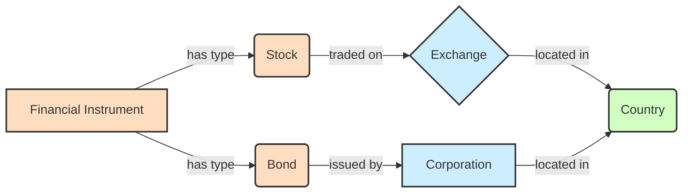
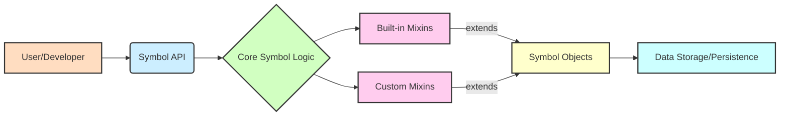

# Symbol Framework: Catalyzing Value and Unifying Knowledge

## Empowering Innovation Through Semantic Precision and Seamless Integration

In today's rapidly evolving technological landscape, the ability to precisely define, manage, and integrate complex concepts is paramount for driving innovation and maintaining a competitive edge. The Symbol framework addresses this critical need by providing a principled approach to representing and manipulating knowledge within software systems. By offering a robust foundation for semantic modeling, Symbol empowers organizations to:

*   **Accelerate Value Creation:** Streamline the development of sophisticated applications by providing a clear, unambiguous way to define and relate domain-specific concepts. This reduces development cycles, minimizes errors, and allows teams to focus on delivering core business logic rather than wrestling with data inconsistencies.
*   **Ensure Seamless Integration:** Facilitate effortless interoperability between disparate systems and data sources. Symbol's emphasis on canonical representation and well-defined relationships ensures that information can flow freely and accurately across organizational boundaries, breaking down data silos and fostering a unified view of critical assets.
*   **Generalize and Unify Knowledge:** Transcend the limitations of rigid, application-specific data models. By enabling the creation of a flexible, extensible knowledge graph, Symbol allows for the generalization of concepts and their relationships, fostering a holistic understanding of complex domains. This unified knowledge base becomes a strategic asset, enabling advanced analytics, intelligent automation, and the development of novel solutions that leverage interconnected insights.

## Illustrative Example: Compact Graph Representation

The Symbol framework excels at representing intricate relationships in a concise and human-readable format. Consider the following example, demonstrating a compact graph of interconnected concepts:

Click to view graph example

- reference TODO:

## Business Impact of a Symbol Domain-Specific Language (DSL)

The adoption of a Symbol-based Domain-Specific Language (DSL) can yield significant business advantages:

*   **Increased Agility:** Rapidly adapt to changing business requirements by modifying the DSL rather than rewriting extensive application code. This accelerates time-to-market for new features and products.
*   **Reduced Development Costs:** Empower domain experts to directly contribute to system logic through the intuitive DSL, minimizing the need for constant developer intervention. This frees up engineering resources for more complex architectural challenges.
*   **Improved Communication and Collaboration:** Foster a shared understanding between business stakeholders and technical teams. The DSL acts as a common language, reducing misinterpretations and ensuring that implemented solutions accurately reflect business intent.
*   **Enhanced Maintainability and Scalability:** Create self-documenting systems where the business logic is explicitly captured in the DSL. This simplifies maintenance, reduces technical debt, and allows for easier scaling of operations.
*   **Greater Data Consistency and Quality:** Enforce semantic rules and constraints directly within the DSL, leading to higher data quality and reduced errors across integrated systems.

## Developer/User-Facing Interface Diagram

## Conclusion

The Symbol framework offers a compelling proposition for organizations seeking to enhance their software development capabilities through semantic precision, seamless integration, and unified knowledge representation. By embracing a Symbol-based approach, businesses can unlock new levels of agility, reduce operational costs, and foster a collaborative environment conducive to innovation.

## Further Documentation

* **README.md**: The main project overview. Ideal for new users and those seeking a high-level understanding of the Symbol framework's purpose and capabilities.
* **docs/guides/1_quick_guide.md**: A rapid introduction to getting started with Symbol. Recommended for developers eager to quickly set up and run their first Symbol application.
* **docs/guides/2_introduction.md**: Provides a more detailed introduction to the core concepts of Symbol. Suitable for users who have completed the quick guide and wish to deepen their understanding.
* **docs/guides/3_advanced_tutorial.md**: Explores advanced features and use cases of the Symbol framework. Aimed at experienced developers looking to leverage Symbol's full potential for complex projects.
* **docs/guides/4_api_documentation.md**: Comprehensive reference for all Symbol APIs. Essential for developers requiring detailed information on functions, classes, and methods.
* **docs/user_manual/index.md**: The central hub for the user manual, providing a structured overview of Symbol's functionalities from a user's perspective. Recommended for all users.
* **docs/cookbook/0_table_of_contents.md**: Table of contents for practical recipes and examples. Useful for developers seeking solutions to specific implementation challenges.
* **docs/development/architecture.md**: Delves into the architectural design of the Symbol framework. Targeted at contributors and architects interested in the internal workings and extensibility of the framework.
* **docs/development/glossary.md**: Defines key terms and concepts used within the Symbol project. Beneficial for all users, especially when encountering unfamiliar terminology.
