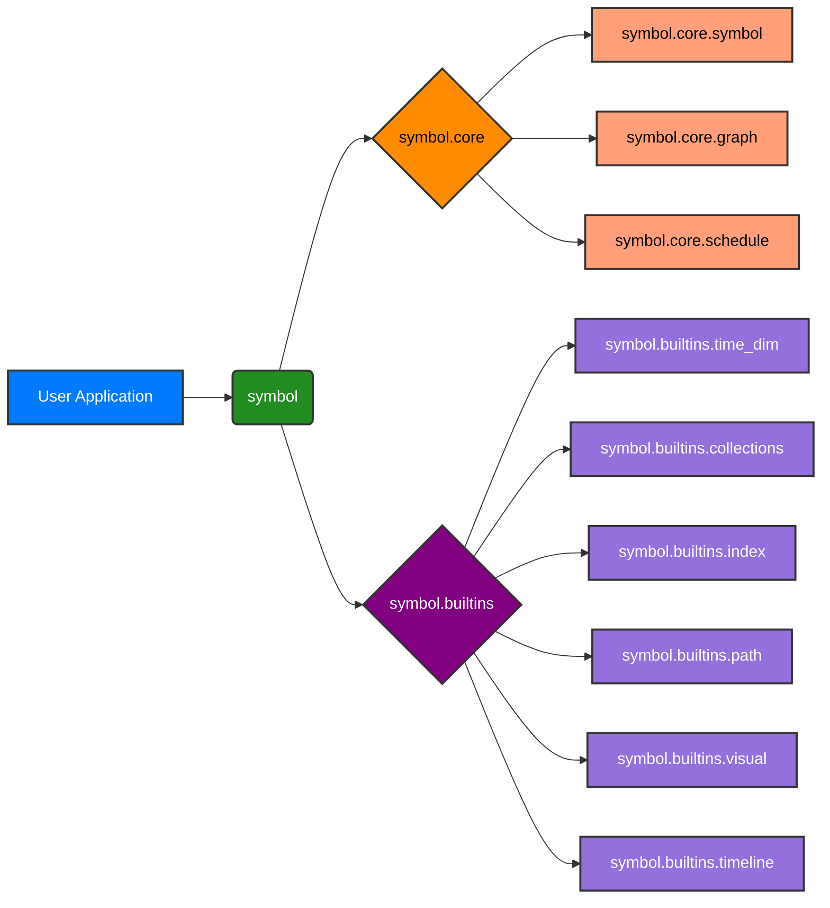
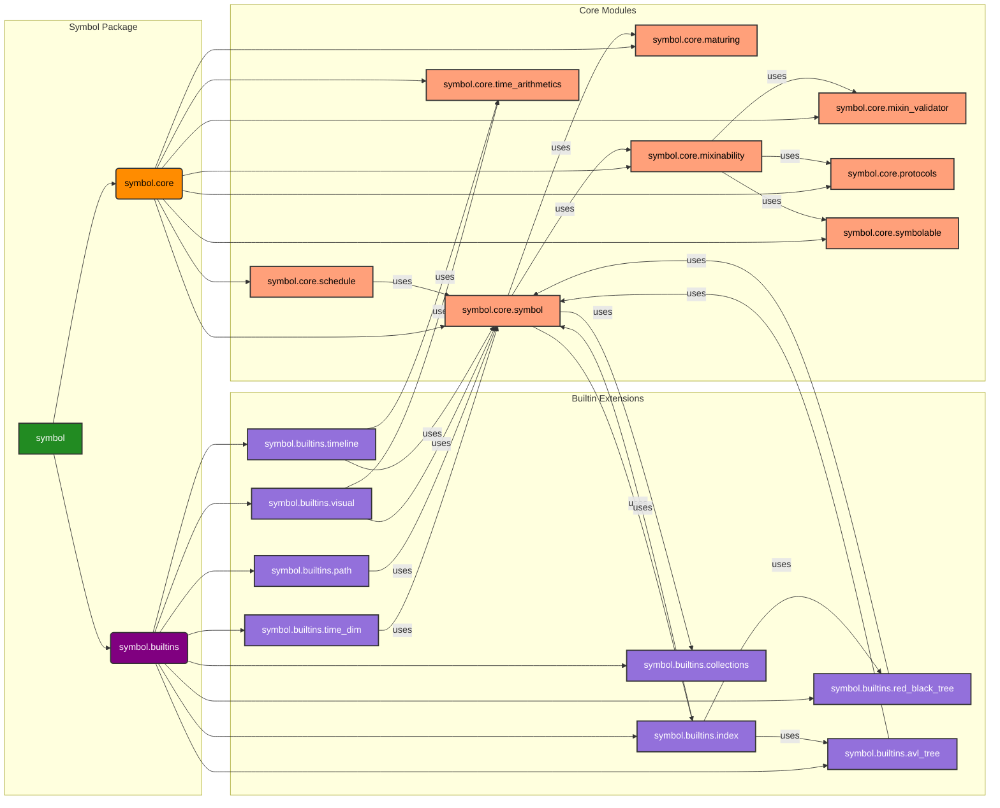

## Project Structure

The project is organized into two main packages:

-   `symbol.core`: Contains the essential `Symbol` class and graph traversal logic.
-   `symbol.builtins`: Provides optional, high-level extensions for collections, date/time operations, index, pathfinding, and visualization.

## Software Architecture

