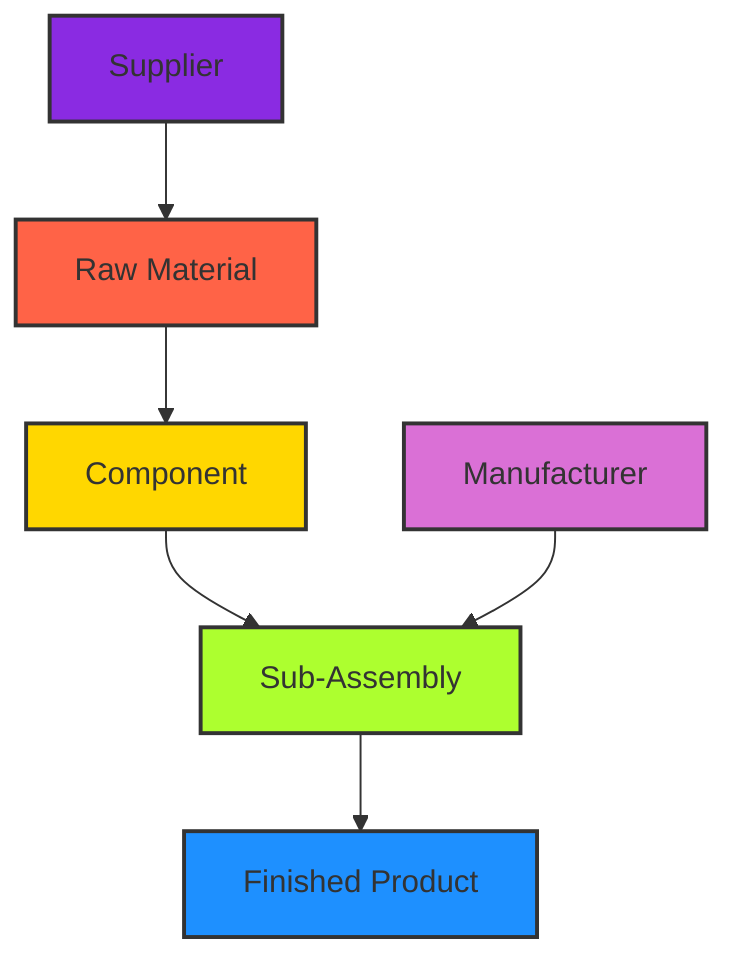

# 1.1 Symbol: The Fundamental Building Block

The `Symbol` object serves as the atomic unit within the framework, embodying a node in a dynamic, directed acyclic graph (DAG). Its design prioritizes uniqueness, efficient relationship management, and extensibility, making it a versatile primitive for diverse symbolic data manipulation tasks.

## Uniqueness and Interning

Each `Symbol` instance is uniquely identified by its `name` attribute. This uniqueness is enforced through an interning mechanism, ensuring that `Symbol('A')` will always return the same object in memory as any subsequent call to `Symbol('A')`. This design choice offers significant advantages:

-   **Memory Efficiency**: Prevents redundant object creation, reducing memory footprint, especially in large graphs with many identical symbolic representations.
-   **Consistency**: Guarantees that operations on a symbol consistently refer to the same underlying entity, simplifying identity checks and graph integrity.
-   **Performance**: Accelerates lookups and comparisons, as identity can often be checked by memory address rather than content comparison.

```mermaid
graph TD
    A[Symbol('A')] --> B{Interning Pool};
    B --> C[Existing Symbol 'A'];
    D[Symbol('A')] --> B;
    E[Symbol('B')] --> B;
    B --> F[New Symbol 'B'];

    style A fill:#FFD700,stroke:#333,stroke-width:2px;
    style D fill:#FFD700,stroke:#333,stroke-width:2px;
    style E fill:#ADFF2F,stroke:#333,stroke-width:2px;
    style B fill:#ADD8E6,stroke:#333,stroke-width:2px;
    style C fill:#90EE90,stroke:#333,stroke-width:2px;
    style F fill:#90EE90,stroke:#333,stroke-width:2px;
```

## Complex Relationships and Graph Structure

`Symbol` objects are designed to form complex relationships, acting as nodes in a directed acyclic graph (DAG). Each `Symbol` maintains references to its `children` (symbols it points to) and `parents` (symbols that point to it). This bidirectional linking facilitates efficient traversal and manipulation of the graph structure.

The framework provides intuitive methods for establishing and managing these relationships:

-   `symbol.add(child)`: Establishes a directed relationship from `symbol` to `child`. If the relationship already exists, it is idempotent.
-   `symbol.append(child)`: Similar to `add`, but ensures the child is added to the end of the children list if not already present.
-   `symbol.delete()`: Removes a symbol from the graph, severing its connections to parents and children.

### Illustrative Example: Supply Chain Modeling

Consider a supply chain where raw materials are transformed into finished goods. Each entity (e.g., "Supplier", "Manufacturer", "Product") can be represented as a `Symbol`. Relationships like "supplies", "manufactures", or "contains" can be modeled by connecting these symbols.



### Code Example: Building a Simple Knowledge Graph

```python
from symbol import Symbol, s

# Create symbols for entities
person = Symbol('Person')
organization = Symbol('Organization')
event = Symbol('Event')
location = Symbol('Location')

# Create specific instances
alice = s.Alice
bob = s.Bob
google = s.Google
conference = s.Tech_Conference_2025
london = s.London

# Establish relationships
alice.add(person)
bob.add(person)
google.add(organization)
conference.add(event)
london.add(location)

alice.add(google) # Alice works at Google
google.add(london) # Google has an office in London
alice.add(conference) # Alice attends the conference
conference.add(london) # Conference is in London

# Traverse and visualize (conceptual)
# print(alice.tree())
# print(google.to_mmd())
```

### Industry Applications

**High-Tech: Semantic Web and Knowledge Graphs**
In the realm of semantic web technologies, `Symbol` can serve as the foundational primitive for constructing knowledge graphs. Each entity (e.g., person, concept, event) becomes a `Symbol`, and relationships (e.g., "has_author", "is_a", "occurs_in") are represented by directed links. This enables sophisticated querying, reasoning, and inferencing over vast, interconnected datasets. For instance, a `Symbol` representing a research paper could be linked to `Symbol`s for its authors, topics, and publication venue, forming a rich semantic network.

**Low-Tech: Inventory Management and Bill of Materials (BOM)**
In manufacturing, `Symbol` can model components and assemblies in a Bill of Materials (BOM). Each part, sub-assembly, and final product can be a `Symbol`. Relationships like "contains" or "is_part_of" define the hierarchical structure of the BOM. This allows for efficient tracking of inventory, cost analysis, and impact assessment of component changes. For example, a `Symbol` for a "Bicycle" could have `Symbol` children for "Frame", "Wheel_Assembly", and "Handlebars", with "Wheel_Assembly" further composed of "Rim", "Spokes", and "Tire".

## Conclusion

The `Symbol` object, with its inherent uniqueness and robust mechanisms for establishing and managing relationships, provides a powerful and flexible foundation for representing and manipulating complex, graph-based data structures across a wide spectrum of applications. Its lean design and extensibility ensure adaptability to evolving domain requirements.
