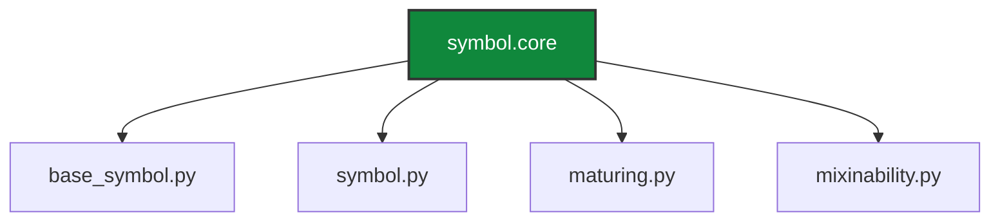
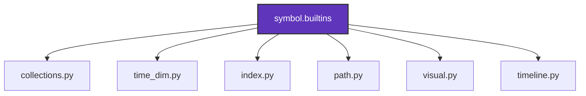

# 1.3 Layered Architecture: Modularity and Extensibility

The `Symbol` framework is designed with a **layered architecture**, a fundamental principle that separates concerns into distinct, hierarchical layers. This approach ensures a lean and stable core while allowing for flexible and modular extension of functionalities. The primary distinction is between the `symbol.core` package, which houses the essential building blocks, and the `symbol.builtins` package, which provides optional, high-level extensions.

## Core Layer &#40;`symbol.core`&#41;

This layer represents the foundational elements of the `Symbol` framework. It contains the absolute minimum necessary for a `Symbol` object to exist and to participate in graph structures. Key characteristics include:

-   **Minimalism**: Focuses solely on the fundamental definition of a `Symbol`, its unique identification &#40;interning&#41;, and the basic mechanisms for establishing and managing relationships &#40;parents, children&#41;.
-   **Stability**: Designed to be highly stable and rarely change, providing a robust base for all other functionalities.
-   **Independence**: Ideally, this layer has minimal dependencies on higher-level components, ensuring its integrity and reusability.


## Builtin Extensions Layer &#40;`symbol.builtins`&#41;

This layer comprises a collection of modular extensions that provide specialized functionalities to `Symbol` objects. These extensions are designed to be plug-and-play, allowing developers to include only the features relevant to their specific application without bloating the core.

-   **Modularity**: Each module within `symbol.builtins` addresses a specific domain &#40;e.g., date/time, collections, visualization&#41;.
-   **Extensibility**: New functionalities can be easily added by creating new modules in this layer, adhering to the framework's extension protocols.
-   **Controlled Dependencies**: While `symbol.builtins` modules depend on `symbol.core`, the `symbol.core` generally remains independent of `symbol.builtins`, maintaining the hierarchical integrity.


## Inter-Layer Communication

The `symbol.core` package, particularly `symbol.py`, integrates with selected `symbol.builtins` modules to enhance its fundamental capabilities. For instance, `SymbolIndex` from `symbol.builtins.index` is used within the `Symbol` class to manage per-instance indexing. This controlled dependency allows the core to leverage specialized, well-encapsulated functionalities without compromising its lean design.

### Code Example: Core Leveraging Builtins

```python
# From symbol/core/symbol.py
from ..builtins.collections import OrderedSymbolSet
from ..builtins.index import SymbolIndex

class Symbol(BaseSymbol):
    def __new__(cls, name: str, origin: Optional[Any] = None):
        obj = super().__new__(cls, name, origin)
        if not hasattr(obj, 'index'):
            obj.index = SymbolIndex(obj) # Core uses a builtin for indexing
            obj.metadata = DefDict()
            obj.context = DefDict()
        # ... rest of __new__
```

### Industry Applications

**High-Tech: Microservices Architecture**
```python
from symbol import s

# Core services
s.AuthService.provides(s.UserAuthentication)
s.DataStorageService.provides(s.DataPersistence)

# Specialized services &#40;builtins&#41;
s.PaymentProcessingService.uses(s.AuthService)
s.RecommendationEngine.uses(s.DataStorageService)

print(f"Payment service uses: {[c.name for c in s.PaymentProcessingService.children]}")
```

**Low-Tech: Modular Furniture Design**
```python
from symbol import s

# Core components
s.BasicFrame.connects_with(s.StandardConnector)

# Add-on modules &#40;builtins&#41;
s.ShelfModule.attaches_to(s.BasicFrame)
s.DrawerModule.attaches_to(s.BasicFrame)

print(f"Basic frame connections: {[c.name for c in s.BasicFrame.children]}")
```

## Conclusion

The layered architecture of the `Symbol` framework is a testament to its robust and scalable design. By clearly separating core functionalities from modular extensions, it achieves a balance between minimalism and extensibility, making it adaptable to a wide array of complex symbolic data manipulation tasks while maintaining a clean and maintainable codebase.
