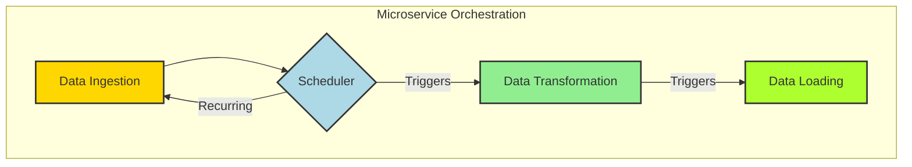
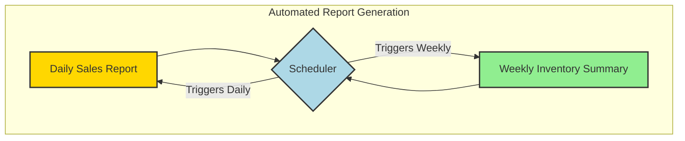

# Scheduling: Event-Driven Automation with Symbol

The `Symbol` framework integrates a robust scheduling mechanism, enabling the deferred and automated execution of tasks. This feature is critical for building event-driven architectures, automating workflows, and managing background processes within applications. The scheduler is designed for flexibility, supporting various scheduling paradigms from precise datetime triggers to recurring cron-like expressions.

## Core Components: ScheduledJob and Scheduler

The scheduling system is built around two primary components:

1.  **`ScheduledJob`**: This class encapsulates a single task to be executed. It holds references to the callable function (`func`), its arguments (`args`, `kwargs`), and crucially, the `schedule` on which it should run. The `schedule` can be a `datetime` object for one-off tasks, a `cron` string for recurring jobs, or even a `Symbol` instance whose name represents an ISO 8601 datetime string.

    ```mermaid
    graph TD
        A[Callable Function] --> B[ScheduledJob];
        C[Arguments (args, kwargs)] --> B;
        D[Schedule (datetime, cron string, Symbol)] --> B;
        B -- "Calculates" --> E[Next Run Time];

        style A fill:#FFD700,stroke:#333,stroke-width:2px;
        style B fill:#ADD8E6,stroke:#333,stroke-width:2px;
        style C fill:#90EE90,stroke:#333,stroke-width:2px;
        style D fill:#90EE90,stroke:#333,stroke-width:2px;
        style E fill:#ADFF2F,stroke:#333,stroke-width:2px;
    ```

2.  **`Scheduler`**: This class manages a collection of `ScheduledJob` instances. It operates in a separate thread, continuously monitoring the jobs and executing them when their `next_run` time arrives. The `Scheduler` uses a min-heap (`_schedule`) to efficiently retrieve the next job to be executed, ensuring timely processing. It also supports persistence, allowing the schedule to be saved to and loaded from a file, thus surviving application restarts.

    ```mermaid
    graph TD
        A[Scheduler] --> B{add_job()};
        B -- "Adds Job to" --> C[Min-Heap];
        C -- "Monitors" --> D[Execution Thread];
        D -- "Executes Job" --> E[Callable Function];
        E -- "If Recurring" --> F[Reschedules Job];

        style A fill:#FFD700,stroke:#333,stroke-width:2px;
        style B fill:#ADD8E6,stroke:#333,stroke-width:2px;
        style C fill:#90EE90,stroke:#333,stroke-width:2px;
        style D fill:#90EE90,stroke:#333,stroke-width:2px;
        style E fill:#ADFF2F,stroke:#333,stroke-width:2px;
        style F fill:#ADFF2F,stroke:#333,stroke-width:2px;
    ```

## Illustrative Examples

### High-Tech Industry: Microservice Orchestration

In a microservices architecture, the `Symbol` scheduler can be used to orchestrate complex workflows, ensuring that dependent services are invoked at the correct times or intervals. For instance, a data processing pipeline might involve several microservices that need to run in a specific sequence.

```python
from symbol.core.schedule import Scheduler, ScheduledJob
import datetime
import time

def data_ingestion_service():
    print(f"[{datetime.datetime.now()}] Data Ingestion Service: Starting data import...")
    time.sleep(1) # Simulate work
    print(f"[{datetime.datetime.now()}] Data Ingestion Service: Data imported.")

def data_transformation_service():
    print(f"[{datetime.datetime.now()}] Data Transformation Service: Starting data transformation...")
    time.sleep(1.5) # Simulate work
    print(f"[{datetime.datetime.now()}] Data Transformation Service: Data transformed.")

def data_loading_service():
    print(f"[{datetime.datetime.now()}] Data Loading Service: Starting data loading...")
    time.sleep(0.5) # Simulate work
    print(f"[{datetime.datetime.now()}] Data Loading Service: Data loaded.")

scheduler = Scheduler()

# Schedule data ingestion to run every minute
job_ingestion = ScheduledJob(data_ingestion_service, args=(), kwargs={}, schedule="* * * * *")
scheduler.add_job(job_ingestion)

# Schedule transformation 10 seconds after ingestion (approximate)
job_transformation = ScheduledJob(data_transformation_service, args=(), kwargs={},
                                  schedule=datetime.datetime.now() + datetime.timedelta(seconds=10))
scheduler.add_job(job_transformation)

# Schedule loading 20 seconds after ingestion (approximate)
job_loading = ScheduledJob(data_loading_service, args=(), kwargs={},
                             schedule=datetime.datetime.now() + datetime.timedelta(seconds=20))
scheduler.add_job(job_loading)

print("Starting microservice orchestration scheduler...")
scheduler.start()

try:
    time.sleep(70) # Let it run for a bit to see recurring ingestion
except KeyboardInterrupt:
    pass
finally:
    scheduler.stop()
    print("Scheduler stopped.")
```



### Low-Tech Industry: Automated Report Generation

For businesses, automated report generation is a common requirement. The `Symbol` scheduler can reliably handle tasks like generating daily sales reports, weekly inventory summaries, or monthly financial statements.

```python
from symbol.core.schedule import Scheduler, ScheduledJob
import datetime
import time

def generate_daily_sales_report():
    print(f"[{datetime.datetime.now()}] Generating daily sales report...")
    # Simulate report generation logic
    time.sleep(0.5)
    print(f"[{datetime.datetime.now()}] Daily sales report generated.")

def generate_weekly_inventory_summary():
    print(f"[{datetime.datetime.now()}] Generating weekly inventory summary...")
    # Simulate report generation logic
    time.sleep(1)
    print(f"[{datetime.datetime.now()}] Weekly inventory summary generated.")

scheduler = Scheduler()

# Schedule daily sales report for 23:00 every day
# Note: In a real scenario, you'd set the time more precisely, e.g., '0 23 * * *'
# For demonstration, we'll schedule it for a few seconds from now.
now = datetime.datetime.now()
daily_report_time = now + datetime.timedelta(seconds=5)
job_daily = ScheduledJob(generate_daily_sales_report, args=(), kwargs={}, schedule=daily_report_time)
scheduler.add_job(job_daily)

# Schedule weekly inventory summary for every Monday at 09:00
# For demonstration, we'll use a cron string for every minute
job_weekly = ScheduledJob(generate_weekly_inventory_summary, args=(), kwargs={}, schedule="* * * * MON")
scheduler.add_job(job_weekly)

print("Starting report generation scheduler...")
scheduler.start()

try:
    time.sleep(70) # Let it run for a bit
except KeyboardInterrupt:
    pass
finally:
    scheduler.stop()
    print("Scheduler stopped.")
```



## Conclusion

The `Symbol` framework's scheduling capabilities provide a powerful and flexible foundation for automating tasks and orchestrating complex processes. By offering diverse scheduling options and robust job management, it empowers developers to build highly responsive and efficient systems, from sophisticated microservice deployments to routine business operations. The persistence feature further enhances its utility by ensuring that scheduled tasks are not lost across application lifecycles.

For a visual representation of the scheduling process, refer to the [Scheduling Flow Diagram](scheduling_flow.mmd).
