Here’s an **in‑depth review** of the Integrated Circuit (IC) industry—organized into sections with structured insights & visualization. Mermaid diagrams use `(`/`)` escapes and color-coded styles.

---

## 1. 🎯 Key Players & Market Overview

### Major IC Manufacturers

* **TSMC**: World's largest pure-play foundry, offers nodes from 3 µm to 3 nm, serving brands like Apple, AMD, Nvidia. Massive global footprint with fabs in Taiwan, USA, Japan, Germany ([ic-online.com][1], [en.wikipedia.org][2]).
* **Samsung Electronics & SK Hynix (South Korea)**: Dominant in memory (DRAM, NAND)—combined \~73% global DRAM share ([en.wikipedia.org][3]).
* **Intel, Infineon, STMicroelectronics**: IDMs with both design & manufacturing capabilities.
* **Soitec**: Leading maker of SOI wafers (substrates) for high-performance & energy-efficient ICs ([en.wikipedia.org][2], [en.wikipedia.org][4]).
* **Amkor Technology**: Top-tier OSAT provider for packaging/testing (\~\$7B revenue) ([en.wikipedia.org][5]).

### Market Size & Growth

* IC market \~ USD 605 bn in 2025, projected to reach USD 837 bn by 2030 (CAGR \~6.7%) ([mordorintelligence.com][6]).
* Others estimate even faster growth: \~USD 696 bn (2024) → USD 1.9 tn by 2032, \~13.4% CAGR .

### Regional Supply-Chain Shift

* "China+1" trend: Malaysia (Penang) grows in assembly/testing (Intel, Micron, Infineon) ([ft.com][7]).
* Taiwan firms (TSMC, Foxconn, Acter, C Sun) expanding into Southeast Asia & Europe ([ft.com][8]).
* ON Semiconductor building capacity in Czech Republic & South Korea to reduce China exposure ([wsj.com][9]).

---

## 2. 🏗️ Value Chain Actors & Workflows

```mermaid
flowchart TD
  style ICIndustry fill:#f9f,stroke:#333,stroke-width:2px,color:black
  Fabless&#40Designers&#41 --> Foundries[TSMC, Samsung, Intel]
  Foundries --> OSAT&#40Amkor, ASE&#41
  OSAT --> PCBManufacturers&#40Unimicron&#41
  PCBManufacturers --> OEMs&#40Automotive, Consumer Electronics&#41
  Foundries --> SubstrateMakers&#40Soitec&#41
  Foundries --> EquipmentSuppliers&#40ASML, AppliedMaterials&#41
```

* **Fabless design houses** (e.g., Qualcomm, AMD) subcontract production to **foundries**.
* **OSAT** providers handle packaging & testing.
* **PCB manufacturers** integrate ICs into final products.
* **Substrate suppliers** (Soitec) provide advanced wafers.
* **Equipment vendors** supply lithography, etching, deposition tools.

---

## 3. 🔗 Supply‑Chain Dynamics

* **Supply‑chain security & diversification**: Building fabs in CEE, USA, South‑East Asia to buffer geopolitical risks ([en.wikipedia.org][5], [ic-online.com][1], [en.wikipedia.org][4]).
* **Choke‑points**: Lithography tools (ASML) & advanced materials remain Western‑dominated; China working to catch up ([ft.com][10]).
* **Environmental costs**: Taiwan’s chip production energy & water footprint increasing by \~8% annually—risk of "carbon lock‑in" ([arxiv.org][11]).

---

## 4. 🧪 R\&D & Innovation

* **Infineon Austria**: \~23% revenue reinvested in R\&D; AI in manufacturing; GaN ICs for green apps ([en.wikipedia.org][12]).
* **Soitec**: R\&D‑driven SOI wafer innovation, global labs .
* AI quality‑control is being adopted in fabs, e.g., DeepVision in China ([ft.com][10]).

---

## 5. 📊 KPIs & Performance Measures

### Industry KPIs (Fabrication & Procurement)

* **Load**: fab utilization rate, wafer throughput.
* **Yield**: % functional dies after test.
* **Cycle time**: time from wafer start to shipping.
* **Cost per wafer/wafer-equivalent**.
* **OEE**: Equipment Overall Effectiveness.
* **Supply‑chain indicators**: supplier reliability, flexibility, technology adoption ([en.wikipedia.org][2], [arxiv.org][11]).
* **Procurement-specific metrics**: Data Envelopment Analysis, Malmquist index for efficiency and innovation evaluation ([ic-online.com][1]).

### Manufacturing & Flow KPIs

* From general manufacturing: inventory turnover, lead-time, rejects, uptime metrics .

---

## 6. 🧩 Unique Strengths & Challenges

### Strengths

* **TSMC**’s leadership in advanced nodes (3 nm → 2 nm in 2025) with EUV mass production ([en.wikipedia.org][2]).
* **Samsung/SK Hynix** dominate memory; SK overtook Samsung in DRAM share Q1 2025 ([en.wikipedia.org][3]).
* **Supply‑chain diversification** bolsters resilience (Malaysia, Czech, S Korea).
* **Substrate innovation** (Soitec’s SOI wafers powering high-efficiency chips).

### Challenges

* **Geopolitical restrictions** on China; US export controls ([en.wikipedia.org][4], [ft.com][10]).
* **Sustainability pressures**: energy/water footprint is growing rapidly ([ft.com][7]).
* **Talent bottlenecks** in new hubs (Malaysia, Czech, USA).
* **Long investment cycles**: new fabs take years and \~\$billions.

---

## 🎨 Visual Overview (Mermaid Diagrams)

### A. Supply Chain Overview


*(Dark BG → white foreground)*

---

### B. IC Market Growth

```mermaid
%% Market Growth Curve
graph LR
  style Growth fill:#eef,color:black,stroke:#333
  2025[USD 605 bn] --> 2030[USD 837 bn];
  2030 --> 2032[USD 1.9 tn]
```



*(Light BG → black fg)*

---

## 7. 🧠 Mastery Curve for Learning IC Ecosystem

```
Steep && Shallow Curve visualization:

Knowledge ↑
|●───────────────◯──────────────◯──────────────>
 Low       Mid         High
```

* **Steep start**: grasp fab roles, foundries, OSAT, substrate—gain quick early understanding.
* **Plateau**: deep dive into materials (SOI), node scaling, EUV lithography.
* **Second climb**: advanced supply-chain strategy, geopolitical dynamics, sustainability KPIs.
* **Plateau**: mastering design‑for‑manufacturing, yield optimization, procurement metrics.

---

## ✅ Suggestions for Effective Learning

* 🪜 **Interactive visual tools** (e.g., Nanographics’ fab process simulators) during steep phase.
* 🧠 **Spaced repetition** for complex KPIs & supply‑chain terms.
* 🧩 Break topics: e.g. study substrate, then node, then packaging sequentially.
* 📈 Maintain logs, e.g., in `TODO.md`, to record key KPIs, fab metrics, supplier ratings.

---

## 🔍 Next Steps

* Explore McKinsey semiconductor insights on sustainability & supply resilience ([visiblealpha.com][13], [mckinsey.com][14]).
* Dive into procurement efficiency: Malmquist index, DEA analysis methods .
* Monitor regional shifts: Malaysia, Czech, USA chip investments ([ft.com][7]).
* Develop dashboards tracking foundry yields, supplier OEE, cycle times—integrate into learning logs.

---

Let me know if you'd like deeper dives—e.g., node technology comparisons, EUV supply chain, or building a KPI dashboard!

[1]: https://ic-online.com/news/post/optimize-procurement-of-integrated-circuits-to-reduce-costs?utm_source=chatgpt.com "Optimize Procurement of Integrated Circuits to Reduce Costs"
[2]: https://en.wikipedia.org/wiki/TSMC?utm_source=chatgpt.com "TSMC"
[3]: https://en.wikipedia.org/wiki/Semiconductor_industry_in_South_Korea?utm_source=chatgpt.com "Semiconductor industry in South Korea"
[4]: https://en.wikipedia.org/wiki/Soitec?utm_source=chatgpt.com "Soitec"
[5]: https://en.wikipedia.org/wiki/Amkor_Technology?utm_source=chatgpt.com "Amkor Technology"
[6]: https://www.mordorintelligence.com/industry-reports/integrated-circuits-market?utm_source=chatgpt.com "Integrated Circuit Market - Size, Industry Demand & Growth"
[7]: https://www.ft.com/content/4e0017e8-fb48-4d48-8410-968e3de687bf?utm_source=chatgpt.com "Malaysia: the surprise winner from US-China chip wars"
[8]: https://www.ft.com/content/95ccd46d-aed3-4d82-aec6-06fedcf18879?utm_source=chatgpt.com "Taiwan's chip industry heads overseas amid supply chain shift"
[9]: https://www.wsj.com/articles/on-semiconductor-looks-to-bolster-supply-chain-to-shield-against-rise-of-chinese-chip-makers-f16fbdff?utm_source=chatgpt.com "ON Semiconductor Looks to Bolster Supply Chain to Shield Against Rise of Chinese Chip Makers"
[10]: https://www.ft.com/content/292e44c6-f924-4fd5-b574-484f3c67d551?utm_source=chatgpt.com "The vulnerabilities holding back Chinese industry"
[11]: https://arxiv.org/abs/2209.12523?utm_source=chatgpt.com "From Silicon Shield to Carbon Lock-in ? The Environmental Footprint of Electronic Components Manufacturing in Taiwan (2015-2020)"
[12]: https://en.wikipedia.org/wiki/Infineon_Technologies_Austria?utm_source=chatgpt.com "Infineon Technologies Austria"
[13]: https://visiblealpha.com/technology/semiconductor-fabrication/semiconductor-kpis/?utm_source=chatgpt.com "KPI Guide: Semiconductor Industry KPIs for Investment Professionals"
[14]: https://www.mckinsey.com/~/media/mckinsey/industries/semiconductors/our%20insights/mckinsey%20on%20semiconductors%202024/mck_semiconductors_2024_webpdf.pdf?utm_source=chatgpt.com "[PDF] McKinsey on Semiconductors"
