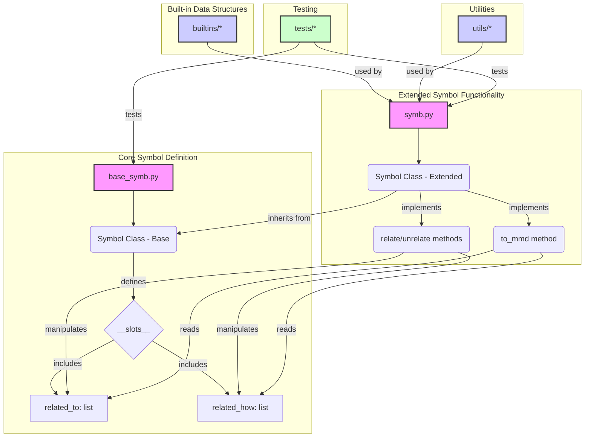

```mermaid
graph TD
    subgraph "Core Symbol Definition"
        A[base_symb.py] --> B(Symbol Class - Base);
        B -- defines --> C{__slots__};
        C -- includes --> D[related_to: list];
        C -- includes --> E[related_how: list];
    end

    subgraph "Extended Symbol Functionality"
        F[symb.py] --> G(Symbol Class - Extended);
        G -- inherits from --> B;
        G -- implements --> H(relate/unrelate methods);
        H -- manipulates --> D;
        H -- manipulates --> E;
        G -- implements --> I(to_mmd method);
        I -- reads --> D;
        I -- reads --> E;
    end

    subgraph "Built-in Data Structures"
        J[builtins/*] -- used by --> F;
    end

    subgraph "Utilities"
        K[utils/*] -- used by --> F;
    end

    subgraph "Testing"
        L[tests/*] -- tests --> F;
        L -- tests --> A;
    end

    style A fill:#f9f,stroke:#333,stroke-width:2px
    style F fill:#f9f,stroke:#333,stroke-width:2px
    style J fill:#ccf,stroke:#333,stroke-width:2px
    style K fill:#ccf,stroke:#333,stroke-width:2px
    style L fill:#cfc,stroke:#333,stroke-width:2px
```
