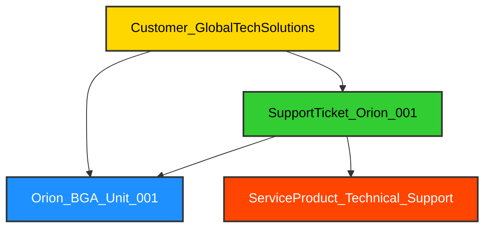

### 2.7 Customer Follow-up & Support: Nurturing Relationships

> **Non-famous Fact/Concept**: In the semiconductor industry, a single customer support ticket, seemingly minor, can sometimes uncover a systemic issue affecting thousands of chips in the field. This is known as the "canary in the coal mine" effect. At H.A.L.42 Inc., our customer support team is not just about resolving immediate problems; they are our frontline intelligence gatherers. We've even implemented a "Bug Bounty for Empathy" program, where support engineers are rewarded for identifying and escalating subtle customer frustrations that might indicate a deeper, underlying product or process flaw. It's a testament to our belief that true quality assurance extends far beyond the factory gates, into the hands and experiences of our end-users.

The final stage of the IC product lifecycle at H.A.L.42 Inc. is Customer Follow-up & Support. This crucial phase ensures customer satisfaction, gathers valuable feedback for future product iterations, and provides technical assistance for any issues encountered in the field. It's where our relationships with partners and end-users are solidified.

`«symbol»` is instrumental in building a comprehensive Customer Relationship Management (CRM) system. We use it to model customer accounts, link them to purchased products, track support tickets, and manage service interactions. This holistic view enables our support teams to quickly diagnose issues, provide personalized assistance, and identify trends that inform product improvements.

Let's model a customer interaction related to our `Project_Orion` AI Accelerator, including a support ticket and its resolution.

```python
>>> # Continuing from Project_Orion sales
>>> # Define customer accounts and support interactions
>>> customer_a = s.Customer_GlobalTechSolutions
>>> support_ticket_orion_001 = s.SupportTicket_Orion_001
>>> service_product_technical_support = s.ServiceProduct_Technical_Support
>>> resolution_firmware_update = s.Resolution_Firmware_Update

>>> # Link customer to purchased product (Orion BGA Unit)
>>> customer_a.add(orion_bga_unit_001)

>>> # Link support ticket to customer and product
>>> customer_a.add(support_ticket_orion_001)
>>> support_ticket_orion_001.add(orion_bga_unit_001)

>>> # Link service product to support ticket
>>> support_ticket_orion_001.add(service_product_technical_support)

>>> # Record ticket details and resolution as metadata
>>> support_ticket_orion_001.metadata['status'] = 'Open'
>>> support_ticket_orion_001.metadata['issue_description'] = 'AI_Inferencing_Stutter_Issue'
>>> support_ticket_orion_001.metadata['priority'] = 'High'

>>> # Simulate ticket resolution
>>> support_ticket_orion_001.metadata['status'] = 'Closed'
>>> support_ticket_orion_001.metadata['resolution'] = resolution_firmware_update
>>> resolution_firmware_update.metadata['version'] = '1.0.1'
>>> resolution_firmware_update.metadata['release_date'] = '2025-07-15'

>>> # Visualize the customer support interaction
>>> print(customer_a.to_mmd())
```
<details>

```text
graph TD
    Customer_GlobalTechSolutions --> Orion_BGA_Unit_001
    Customer_GlobalTechSolutions --> SupportTicket_Orion_001
    SupportTicket_Orion_001 --> ServiceProduct_Technical_Support
    SupportTicket_Orion_001 --> Orion_BGA_Unit_001
```
</details>



### Learning Outcomes:

*   🤝 You've learned to model customer accounts and their relationships with products and support tickets using `«symbol»`.
*   🎫 You've seen how to track support ticket details, status, and resolution as metadata.
*   🔄 You've understood how `«symbol»` can link resolutions (e.g., firmware updates) back to the affected products.
*   📞 You've gained insight into `«symbol»`'s role in building a comprehensive CRM system and facilitating efficient issue resolution.
