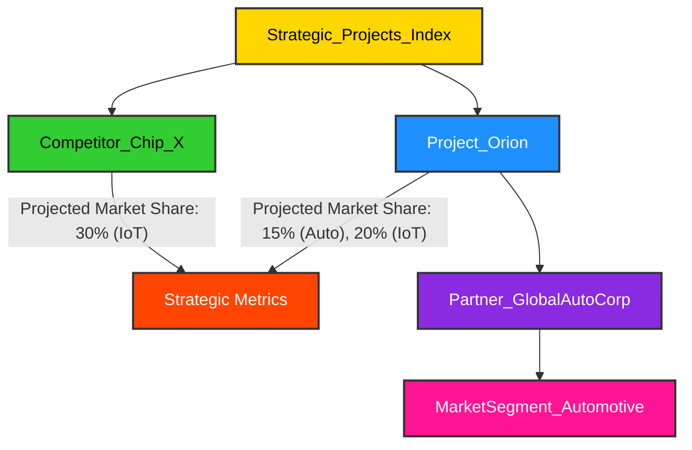

### 3.3 Leveraging `«symbol»` for Strategic Decision Making: The Oracle of Orion

> **Non-famous Fact/Concept**: In the high-stakes world of semiconductor investment, a common pitfall is the "sunk cost fallacy," where companies continue to pour resources into a failing chip design or fab process simply because of past investments. At H.A.L.42 Inc., we combat this cognitive bias with our "Oracle of Orion" initiative. This isn't a mystical entity, but a sophisticated `«symbol»`-powered knowledge graph that integrates real-time market data, R&D progress, manufacturing yields, and customer feedback. The 'Oracle' (our AI-driven analytics engine) can then simulate various strategic scenarios, highlighting potential future sunk costs before they materialize. It's a cold, hard, data-driven truth-teller, ensuring our decisions are based on future potential, not past expenditures.

Strategic decision-making in the semiconductor industry is a complex endeavor, requiring the synthesis of vast amounts of data from diverse sources. Decisions regarding new product development, market entry, technology investments, and supply chain resilience can have multi-billion dollar implications and long-term consequences. Traditional business intelligence tools often provide static snapshots, making it difficult to model dynamic interactions and predict future outcomes.

`«symbol»` provides H.A.L.42 Inc. with a dynamic, interconnected knowledge graph that serves as a powerful tool for strategic decision-making. By integrating data from all stages of the IC product lifecycle – from initial concept to customer support – and combining it with external market intelligence, we can gain a holistic view of our operations and the competitive landscape. This enables us to perform sophisticated analyses, identify emerging opportunities and risks, and simulate the impact of various strategic choices.

Let's demonstrate how `«symbol»` can be used to evaluate the strategic positioning of `Project_Orion` in the market, considering its features, target segments, and competitive landscape.

```python
>>> # Recall existing symbols: project_orion, market_segment_automotive, market_segment_industrial_iot
>>> # competitor_chip_x

>>> # Define strategic metrics as metadata for Project_Orion
>>> project_orion.metadata['projected_market_share_automotive'] = 0.15 # 15% in automotive
>>> project_orion.metadata['projected_market_share_industrial_iot'] = 0.20 # 20% in industrial IoT
>>> project_orion.metadata['r_and_d_investment_usd'] = 500_000_000 # 500 Million USD
>>> project_orion.metadata['time_to_market_months'] = 18

>>> # Define strategic metrics for Competitor_Chip_X
>>> competitor_chip_x.metadata['projected_market_share_industrial_iot'] = 0.30 # 30% in industrial IoT
>>> competitor_chip_x.metadata['r_and_d_investment_usd'] = 700_000_000
>>> competitor_chip_x.metadata['time_to_market_months'] = 24

>>> # Model a strategic partnership with a major automotive OEM
>>> partner_automotive_oem = s.Partner_GlobalAutoCorp
>>> project_orion.add(partner_automotive_oem)
>>> partner_automotive_oem.add(market_segment_automotive)

>>> # Use Symbol's indexing to prioritize strategic initiatives
>>> # We can define a custom weight function for strategic importance
>>> def strategic_importance_weight(sym: Symbol) -> float:
>>>     if sym.name == 'Project_Orion':
>>>         return project_orion.metadata.get('projected_market_share_automotive', 0) * 100 + \
>>>                project_orion.metadata.get('projected_market_share_industrial_iot', 0) * 100
>>>     elif sym.name == 'Competitor_Chip_X':
>>>         return competitor_chip_x.metadata.get('projected_market_share_industrial_iot', 0) * 100
>>>     return 0.0

>>> # Insert projects into a strategic index based on their calculated importance
>>> strategic_projects_index = s.Strategic_Projects_Index
>>> strategic_projects_index.index.insert(project_orion, weight=strategic_importance_weight)
>>> strategic_projects_index.index.insert(competitor_chip_x, weight=strategic_importance_weight)

>>> # Traverse the strategic index to see prioritized projects
>>> print(f"Strategic Projects (by importance): {[sym.name for sym in strategic_projects_index.index.traverse(order='in')]}")
```
<details>

```text
Strategic Projects (by importance): ['Competitor_Chip_X', 'Project_Orion']
```
</details>



### Learning Outcomes:

*   🎯 You've learned how `«symbol»` can integrate diverse data points for holistic strategic analysis.
*   📊 You've seen how to define and attach strategic metrics as metadata to `Symbol` objects.
*   🤝 You've understood how to model strategic partnerships and their market implications.
*   🔍 You've gained insight into using `SymbolIndex` with custom weighting functions to prioritize strategic initiatives.
*   🔮 You've grasped `«symbol»`'s potential as a tool for simulating scenarios and informing high-level business decisions.
